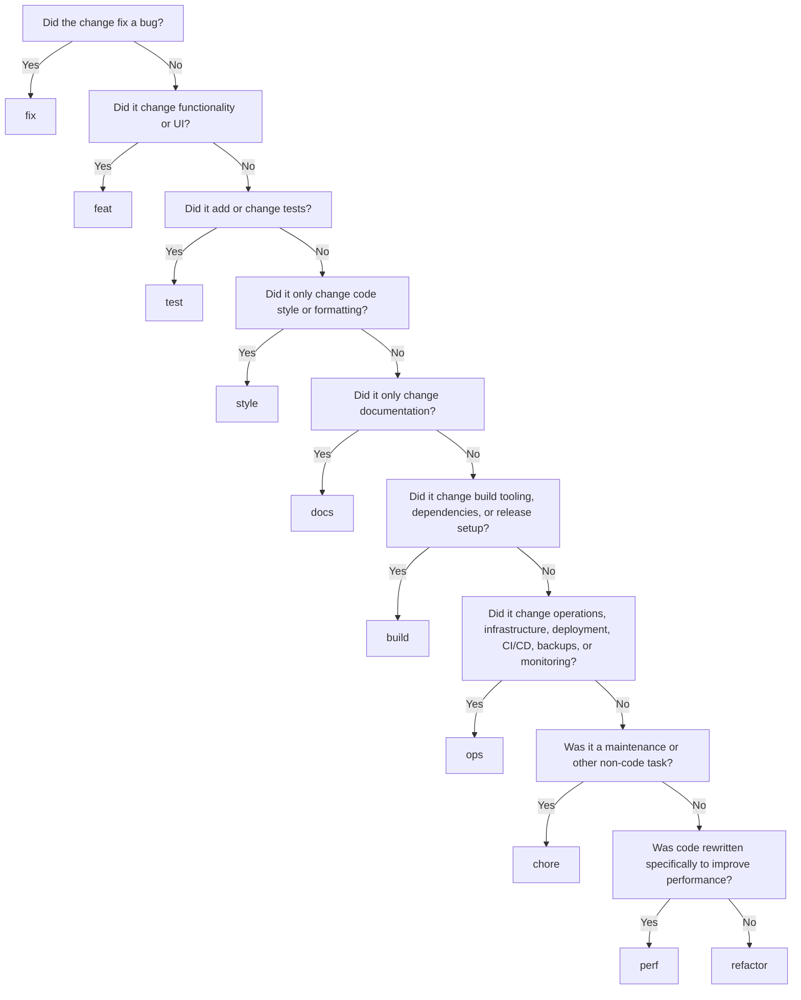

# Conventional Commits: AI Reference

Use this reference when generating, reviewing, or classifying Git commit messages. The goal is to produce clear, machine-readable commit history that follows Conventional Commits while remaining practical for a project.

This file is the commit-message source of truth for AI-assisted commits in this repository. Human contributors may omit the AI-generation footers; see `CONTRIBUTING.md`. Upstream cherry-pick and adapt subjects stay verbatim; see `.agents/skills/sync-upstream/SKILL.md`. Agents may open commits, Issues, and PRs; they must not merge. See `AI_POLICY.md` and `.agents/shared/ai-contribution/REFERENCE.md`.

## 1. Required Header Format

```text
<type>(<optional scope>): <description>
```

Examples:

```text
feat(auth): add passkey sign-in
fix(api): prevent duplicate webhook delivery
docs: clarify local setup steps
```

Rules:

- `type` is required.
- `scope` is optional and gives local context; use only project-defined, meaningful scopes such as `api`, `auth`, `cli`, or `build`.
- Do **not** use issue identifiers as scopes. Use a footer instead, for example `Fixes #123`.
- `description` is required.
- Add `!` immediately before `:` when the change is breaking:

```text
feat(api)!: remove legacy status endpoint
```

## 2. Choosing the Type

Classify the change by its primary intent. Apply this decision order:



| Type       | Use when                                                                                                    | Do not use when                                                  |
| ---------- | ----------------------------------------------------------------------------------------------------------- | ---------------------------------------------------------------- |
| `feat`     | Adding, changing, or removing user-visible/API functionality                                                | The change merely corrects an existing defect                    |
| `fix`      | Correcting a bug in existing API or UI behavior                                                             | Adding a new capability                                          |
| `refactor` | Restructuring code without changing external/API/UI behavior                                                | The primary intent is performance improvement                    |
| `perf`     | Improving performance, memory use, latency, or throughput without intended behavior change                  | The change is a general cleanup                                  |
| `test`     | Adding, correcting, or updating tests                                                                       | Product code changes are the primary purpose                     |
| `style`    | Formatting, whitespace, lint-only changes, semicolons, import ordering, etc., with no behavior change       | Code restructuring or functional changes                         |
| `docs`     | Documentation-only changes                                                                                  | Any code/configuration behavior change is included               |
| `build`    | Build system, packaging, dependencies, project version, or release build components                         | Deployment, infrastructure, CI/CD, monitoring, or backup changes |
| `ops`      | Infrastructure-as-code, deployment scripts, CI/CD, backups, monitoring, recovery, operational configuration | Local developer tooling or package/build dependency work         |
| `chore`    | Maintenance or non-code work, such as initialization or `.gitignore` changes                                | A more specific type accurately applies                          |

## 3. Description Rules

Write a concise command-style description.

- Use imperative present tense: `add`, `fix`, `remove`, `update`, `prevent`.
- Imagine the phrase: “This commit will …”.
- Start with lowercase.
- Do not end with a period.
- State the outcome or intended change, not implementation trivia unless that is the relevant outcome.
- Keep the header focused on one logical change.

Good:

```text
fix(cart): prevent checkout with an empty cart
feat(notifications): add email alerts for direct messages
perf(analytics): reduce unique-visitor memory usage
```

Avoid:

```text
Fixed bug.                         # past tense, capitalized, period, vague
feat: Changes stuff                # capitalized and vague
update files                       # no type and lacks context
fix: fixed the issue               # redundant and vague
```

## 4. Optional Body and Footer

Use blank lines to separate the header, body, and footer.

```text
<type>(<scope>): <description>

<optional body>

<optional footer>
```

### Body

Use a body when a short header cannot explain the motivation, important tradeoff, or difference from previous behavior. Write it in imperative present tense.

```text
fix(auth): prevent refresh-token reuse

Invalidate the active token family after a refresh token is used so a
replayed token cannot create another valid session.
```

### Footer

Use footers for issue references, breaking-change details, and AI-generation metadata.

```text
feat(api)!: remove legacy status endpoint

Replace the endpoint with the health endpoint.

BREAKING CHANGE: clients must use GET /health instead of GET /status
Fixes #123
AI-Generated: true
Generated-At: 2026-08-25T20:34:00Z
```

Rules for breaking changes:

- A breaking change must include `!` before the header colon.
- A breaking change must include a `BREAKING CHANGE:` footer unless the header/body already explains it sufficiently; including the footer is preferred.
- Write `BREAKING CHANGE:` exactly.

## 5. AI Generation Metadata

When an AI generates, proposes, or finalizes a commit message, include the UTC generation time and explicitly label it as AI-generated.

Use this command to obtain the timestamp:

```sh
date -u '+%Y-%m-%dT%H:%M:%SZ'
```

Add the result as commit-message footers, after issue references and any `BREAKING CHANGE:` footer:

```text
AI-Generated: true
Generated-At: <UTC ISO 8601 timestamp>
```

Rules:

- Use UTC only, formatted as ISO 8601: `YYYY-MM-DDTHH:MM:SSZ`.
- Generate the timestamp when the AI prepares the final commit message.
- Keep these fields in the footer, separated from the body by a blank line.
- Do not place timestamps or AI attribution in the header description.
- Preserve the standard Conventional Commit fields; AI metadata is additional project-specific metadata.

Example:

```text
fix(api): prevent duplicate webhook delivery

Reject a delivery identifier that has already been processed.

Fixes #482
AI-Generated: true
Generated-At: 2026-08-25T20:34:00Z
```

## 6. Special Commit Formats

Use Git’s standard formats for merge and revert commits rather than forcing the normal header format.

```text
chore: init
```

```text
Merge branch 'feature/authentication'
```

```text
Revert "feat(auth): add passkey sign-in"
```

## 7. AI Generation Procedure

Before generating a commit message:

1. Identify every changed file and the user-visible, API-visible, operational, test, or maintenance outcome.
2. Select the most specific primary type using the decision flow.
3. Select a scope only if it is established by the repository or clearly meaningful.
4. Determine whether a compatibility break exists. If yes, use `!` and a `BREAKING CHANGE:` footer.
5. Write one lowercase imperative description without terminal punctuation.
6. Add a body only for motivation, behavior contrast, constraints, or non-obvious consequences.
7. Add issue references only in the footer.
8. Run `date -u '+%Y-%m-%dT%H:%M:%SZ'` and append `AI-Generated: true` plus `Generated-At: <result>` in the footer.

When a commit contains unrelated changes, recommend splitting it into separate commits. If splitting is impossible, choose the type that best represents the primary purpose and explain secondary effects in the body.

## 8. Examples

```text
feat: add email notifications for new direct messages
```

```text
feat(cart): add expedited-shipping option
```

```text
fix(api): correct request-body checksum calculation
```

```text
fix: add missing service-call parameter

Pass the tenant identifier so the downstream service can resolve the
correct configuration.

AI-Generated: true
Generated-At: 2026-08-25T20:34:00Z
```

```text
perf(analytics): reduce unique-visitor memory usage with HyperLogLog
```

```text
refactor(math): implement fibonacci calculation recursively
```

```text
style: remove extra blank line
```

```text
test(api): cover invalid webhook signature
```

```text
build: update dependencies
```

```text
build(release): bump version to 1.0.0
```

```text
ops(ci): cache pnpm store in release workflow
```

```text
chore: update gitignore entries
```

## 9. Validation Checklist

Before returning a message, verify:

- Header matches `<type>(<optional scope>): <description>`.
- Type is one of: `feat`, `fix`, `refactor`, `perf`, `style`, `test`, `docs`, `build`, `ops`, `chore`.
- Scope is optional, meaningful, and not an issue ID.
- Description is lowercase, imperative, concise, and has no final period.
- `!` appears before `:` for breaking changes.
- Breaking changes include a `BREAKING CHANGE:` footer when needed.
- Issue IDs occur in footers, such as `Fixes #123` or `Closes JIRA-456`.
- AI-produced messages include `AI-Generated: true` and a current UTC `Generated-At:` footer.
- The chosen type reflects the main intent, not merely the files touched.

## 10. Versioning Interpretation

For release automation, interpret commits as follows:

- Any breaking change: major version increment.
- Any API/UI-relevant `feat` or `fix`, with no breaking change: minor version increment according to this project convention.
- Otherwise: patch version increment.

Repository-specific release rules may override this mapping.
